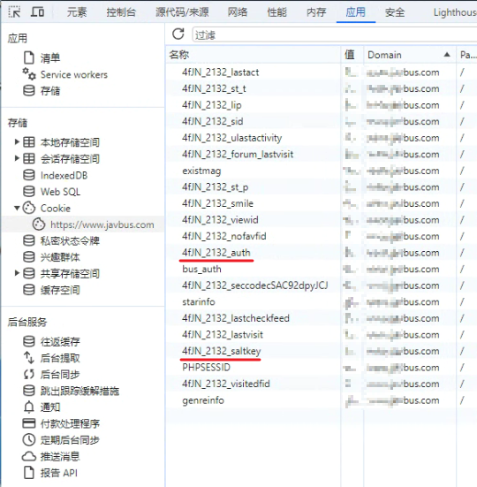

# JavBus论坛签到脚本

## 青龙面板配置

### 依赖

Python3

```bash
requests
beautifulsoup4
```

### 环境变量
| 变量名              | 变量值获取方式                  | 必选 | 默认值                           | 描述                  |
|------------------|--------------------------| ---- |-------------------------------|---------------------|
| javbus_client_id | 系统设置>>应用设置>>创建应用(环境变量权限  | 必选 | -                             | 青龙面板用户权限，用于添加修改环境变量 |
| javbus_client_secret    | 系统设置>>应用设置>>创建应用(环境变量权限) | 必选 | -                             | 青龙面板用户权限，用于添加修改环境变量 |
| javbus_saltkey   | 请登录站点查看                  | 必选 | -                             | 服务器加密               |
| javbus_auth      | 请登录站点查看必选                | 必选 | -                             | 加密密钥                |
| javbus_username  | 用户名                      | 必选 | -                             | 效验签到用户              |
| javbus_sign      | 签到记录                     | 可选 | false                         | `true`/`false`      |
| javbus_cookie    | 自动续期                     | 可选 | true                          | `true`/`false`      |
| proxy_enable     | 代理                       | 可选 | false                         | `true`/`false`      |
| proxy_host       | 代理主机                     | 可选 | -                             | 示例：127.0.0.1        |
| proxy_port       | 代理端口                     | 可选 | -                             | 示例：7890             |
| proxy_username   | 鉴权用户名                    | 可选 | -                             | 身份验证                |
| proxy_password   | 鉴权密码                     | 可选 | -                             | 身份验证                |
| javbus_sign_url  | 签到地址                     | 可选 | https://www.javbus.com/forum/ | 论坛（镜像）地址            |
| ql_host          | 青龙地址                     | 可选 | http://127.0.0.1:5700         | 青龙地址(IP或域名)         |


> 获取加密盐
>
> `javbus_saltkey`

F12 唤出开发者控制台 >> 应用 >> Cookie >> 获取 `xxx_xxx_saltkey`



> 获取授权密钥 
> 
> `javbus_auth`

+ 可参考上方 ：`xxx_xxx_auth`

```sh
# 方案一(获取并复制)：
copy(document.cookie.match(/4fJN_2132_auth=([^;]+)/)[1]); console.log(document.cookie.match(/4fJN_2132_auth=([^;]+)/)[1]);

# 方案二(仅输出)
document.cookie.match(/4fJN_2132_auth=([^;]+)/)[1];
```

## 一键订阅

```bash
ql repo https://github.com/QYG2297248353/ql_sign_javbus.git "auto_" "" "__init__|core_|utils_"
```
